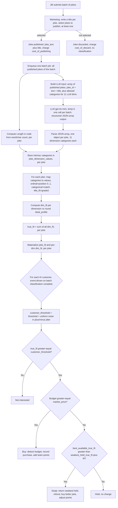

# Joke Factory Backend — Refactor Plan (WIP)

> Living document. We are building this collaboratively. Nothing here is final yet.

---

## 1. AI Customers (replacing human customers)

### Concept
- **Remove human customers entirely.** The `CUSTOMER` role/interface is replaced by **AI customers** that judge published jokes and decide whether to "buy" them.
- AI customers evaluate each joke against a **hidden ideal joke profile**.
- **One shared profile per game:** before the round/game starts, the **instructor selects the ideal joke profile** (the preferred category for each dimension). All AI customers share this same hidden profile — i.e. they all "like" the same kind of joke.
- The closer a joke matches the ideal profile, the more likely the AI customers are to buy it. (Exact scoring/buying mechanics = next discussion.)

### The 12 judging dimensions
Each joke is classified into exactly one category per dimension.

| # | Dimension | Categories | Classified by | Scoring type |
|---|-----------|-----------|---------------|--------------|
| 1 | Length | Short / Medium / Long | **Programmatic** (word/char count) | Ordinal |
| 2 | Topic | *(categories TBD)* | LLM | Categorical |
| 3 | Humor Style | Pun / Observational / Irony / Absurdity / Exaggeration / Self-deprecating / Anti-joke / Callback | LLM | Categorical |
| 4 | Complexity | Very simple / Simple / Moderate / Thoughtful / Expert | LLM | Ordinal |
| 5 | Edginess | Clean / Slightly edgy | LLM | Categorical |
| 6 | Structure | *(categories TBD)* | LLM | *(TBD)* |
| 7 | Wordplay | None / Light / Moderate / Heavy | LLM | Ordinal |
| 8 | Freshness | Timeless / Slightly current / Current / Very topical / Time-sensitive | LLM | Ordinal |
| 9 | Setup -> Payoff | Immediate / Quick / Balanced / Long / Very long build | LLM | Ordinal |
| 10 | Clarity | Crystal clear / Mostly clear / Slightly ambiguous / Ambiguous / Reinterpretation | LLM | Ordinal |
| 11 | Energy | Deadpan / Low / Conversational / Animated / High-energy | LLM | Ordinal |
| 12 | Title Fit | Perfect / Strong / Moderate / Weak / Mismatch | LLM | Graded (intrinsic) |

- **Length** can be determined programmatically (comparing word/character length); all other dimensions require an **LLM** to classify which category the joke falls into.
- **Title Fit** = how well the marketing/title chosen fits the joke's actual theme.

---

## 2. Scoring & Buy Mechanics

### 2.1 Category position values (set before the round)
Ordinal dimensions map each category to an evenly-spaced position value in `[0, 1]`:

- **Length** (3 levels): `{0, 0.5, 1}`
- **Wordplay** (4 levels): `{0, 0.33, 0.67, 1}`
- **Complexity, Freshness, Setup -> Payoff, Clarity, Energy** (5 levels): `{0, 0.25, 0.5, 0.75, 1}`

For these dimensions the instructor's chosen ideal category gives us an **`ideal_pos`**, and the system's classification of the joke gives a **`joke_pos`**.

### 2.2 Per-dimension fit (`dim_fit`)
- **Ordinal dims** (Length, Complexity, Freshness, Setup -> Payoff, Clarity, Energy, Wordplay):
  ```
  dim_fit = 1 - |joke_pos - ideal_pos|
  ```
  (Max `1` = exact match; decreases with distance; range `[0, 1]`.)
- **Categorical / binary dims** (Topic, Humor Style, Edginess):
  ```
  dim_fit = 1 if joke category == ideal category, else 0
  ```
- **Title Fit** (intrinsic, graded, NOT compared to an ideal):
  ```
  Perfect = 1.0, Strong = 0.75, Moderate = 0.5, Weak = 0.25, Mismatch = 0
  ```

### 2.3 True fit
```
true_fit = sum(dim_fit for all dimensions)   // target range 0 - 12
```
Each of the 12 dimensions contributes at most `1`, so the full total is in `[0, 12]`.

> **Note:** dimension #6 **Structure** is currently an undefined placeholder. Until its categories + scoring are defined it contributes `0`, so the **effective range is `[0, 11]`** for now.

### 2.4 Threshold (instructor-configured, per round)
- The instructor sets a **threshold** at the start of the round.
- A joke is "good enough" for a customer when its `true_fit` meets that customer's threshold.

### 2.5 Jitter (instructor-configured, per round)
- The instructor sets a **jitter** value (e.g. `0.3`), which is the **standard deviation** of the per-customer threshold.
- Each AI customer's personal threshold is drawn from a **normal distribution** centered on the base threshold, with `jitter` as the standard deviation:
  ```
  customer_threshold = normal(mean = threshold, sd = jitter)
  ```
- Most customers sit near the base threshold; the tails (much pickier / much more lenient) are rare. This gives a realistic bell-shaped spread of standards rather than a hard uniform band, so a joke sitting near the threshold sells to roughly the share of customers whose bar it clears.
- *(Updated from the earlier uniform `[-jitter, +jitter]` model.)*

### 2.6 Buy decision
Once a joke has been rated and has a `true_fit`, for each AI customer:
```
if true_fit >= customer_threshold AND customer has enough budget:
    customer buys the joke
```

### 2.7 Swap (out of budget)
When a customer is **out of budget**, they can still upgrade their holdings via a swap, governed by an instructor-configured **swap margin `M` (default `0.5`)**:
```
if best available joke's true_fit > (weakest held joke's true_fit + M):
    return the weakest held joke   // frees budget
    buy the better joke
else:
    hold (no change)
```
- "Best available joke" = the highest-`true_fit` joke currently available to buy (that still meets the customer's threshold).
- "Weakest held joke" = the lowest-`true_fit` joke the customer currently owns.
- The swap only happens when the improvement strictly exceeds the margin `M`; otherwise the customer keeps what they have.
- **Threshold always applies:** every joke a customer holds — bought normally or swapped in — must have `true_fit >= customer_threshold`.
- **Tie-breaking:** if multiple jokes tie on `true_fit` for "best available" or "weakest held", the system picks **randomly**.

---

## 3. Instructor-Configured Parameters

All configured by the instructor before/at the start of a round.

| Parameter (key) | Description | Default |
|-----------------|-------------|---------|
| Ideal Joke Profile (`ideal_profile`) | The hidden "ideal" category chosen for each judged dimension (12 dim levels). Defines the jokes AI customers prefer; shared by all AI customers; locked at round start. | (12 dim levels) |
| Buy Threshold (`buy_threshold`, τ) | Minimum `true_fit` (range `0-12`) a joke must reach for a customer to buy it. | `7` (of 12) |
| Jitter (`jitter`) | Per-customer uniform noise on the threshold, `customer_threshold = threshold + uniform_random(-jitter, +jitter)`, so customers aren't identical. | `±0.3` |
| Swap Margin (`swap_margin`, M) | Minimum `true_fit` improvement for an out-of-budget customer to return their weakest held joke and buy a better one. | `0.5` |
| Number of AI Customers (`customer_count`) | How many AI customers participate in the round (affects max possible sales/points). | `100` |
| Customer Budget (`customer_budget`) | Starting **currency** budget per AI customer; each purchase deducts `market_price`. Determines how many jokes each can hold. | `$3.00` |
| Market Price (`market_price`) | Revenue per sale. | `$1.00` |
| Cost of Publishing (`cost_of_publishing`) | Marketing cost per published joke. | `$0.10` |
| Cost of Discard (`cost_of_discard`) | **NEW** — marketing cost per discarded joke. | `$0.01` |
| Batch Size (`batch_size`) | Round 1 fixed batch size / Round 2 cap. | `5` |
| Feedback Joke Count (`feedback_joke_count`) | How many latest published jokes the JM/Marketing feedback view shows per team (Section 7). | `3` |
| Feedback Pass Threshold (`feedback_pass_threshold`) | `dim_fit` cutoff for a dimension to count as a "pass"/good in feedback (Section 7). | `0.75` |

> Excluded from the reference table (not needed): `session_seed`, `llm_call_ceiling`, `tick_seconds`.

---

## 4. LLM Classification Pipeline (Technical Design)

### 4.1 LLM call  **[UPDATED: one call per batch]**
- **Model:** OpenAI `gpt-4o-mini`, **temperature 0** (cheap, fast, deterministic).
- **One call per batch, not per joke.** Since jokes arrive and are processed as a batch, a single call classifies **all published jokes in that batch at once** on the **11 LLM dimensions** (Length is computed in code, not sent to the LLM). This cuts LLM calls roughly by the batch size.
- **Structured output:** use JSON schema / structured outputs so the model returns a strict **array**, one object per joke, keyed by `joke_id`:
  ```json
  {
    "jokes": [
      {
        "joke_id": 9101,
        "topic": "Work", "humor_style": "OBSERVATIONAL", "complexity": "MODERATE",
        "edginess": "CLEAN", "structure": "...", "wordplay": "LIGHT",
        "freshness": "TIMELESS", "setup_payoff": "BALANCED", "clarity": "MOSTLY_CLEAR",
        "energy": "CONVERSATIONAL", "title_fit": "STRONG"
      },
      {
        "joke_id": 9103,
        "topic": "Food", "humor_style": "PUN", "complexity": "SIMPLE",
        "edginess": "CLEAN", "structure": "...", "wordplay": "HEAVY",
        "freshness": "TIMELESS", "setup_payoff": "QUICK", "clarity": "CRYSTAL_CLEAR",
        "energy": "ANIMATED", "title_fit": "MODERATE"
      }
    ]
  }
  ```
- The prompt includes each published joke's `joke_id` + text + title and the allowed categories per dimension; the model must return exactly one object per input joke, each with exactly one category per dimension.
- The program then runs the **same per-joke logic** (Length in code, position mapping, `dim_fit`, `true_fit`) over each element of the returned array.

### 4.2 When classification is triggered
- Classify **when Marketing processes a batch** (titles set + publish/discard chosen). We enqueue **one batch classification job** covering that batch's **published** jokes only (discarded jokes are never classified). Only published jokes reach the market / get bought, so this minimizes LLM cost, and **Title Fit needs the final title**, which isn't known until publish.

### 4.3 Async processing model
- **Chosen: in-memory channel + goroutine worker pool** (now **batch-grained**).
  1. When a batch is processed, push a **batch job** (`batch_id` + its published `joke_id`s) onto a buffered Go channel.
  2. A pool of N worker goroutines reads a job, computes Length in code for each joke, makes **one LLM call for the whole batch**, then writes per-joke results.
  3. Retry with in-process backoff on transient LLM errors; give up after max attempts and mark the batch's classification status `FAILED` (still persisted in the status table).
- **Durability gap + mitigation:** queued/in-flight work is lost if the BE restarts or crashes. Add a **startup reconciler** that scans for **processed batches whose published jokes are unclassified** (status `PENDING`/`FAILED` or missing) and re-enqueues those batch jobs. A periodic sweep can also re-enqueue stragglers.
- **Backpressure:** use a bounded (buffered) channel; if full, either block the publisher briefly or drop-and-rely-on-reconciler.
- Note: we keep a lightweight `classification_jobs`/status record **per batch** (Section 4.4) for state/observability and to power the reconciler — the *queue itself* is in memory.

### 4.4 Storage model
Separate **intrinsic classification** (a property of the joke) from **fit** (computed against a round's ideal profile). Note the job/status is now **per batch**, while results remain **per joke**.

- **Job/status table** `classification_jobs` (**batch-keyed**):
  `batch_id (PK)`, `round_id`, `status` (PENDING/PROCESSING/DONE/FAILED), `attempts`, `last_error`, `model`, `created_at`, `updated_at`, `classified_at`.
- **Intrinsic classifications** — **normalized/long** table `joke_dimension_values` (per joke; matches the "joke id, dim id, value" idea and is flexible):
  `joke_id`, `dimension` (enum/text), `category` (text), `position` (numeric, null for categorical), `PRIMARY KEY (joke_id, dimension)`.
- **Materialized fit** (see 4.5) — persisted per joke once its batch classification completes:
  - `joke_fit`: `joke_id`, `round_id`, `true_fit` (numeric), `computed_at`, `PRIMARY KEY (joke_id, round_id)`.
  - Per-dim `dim_fit`: its own table `joke_dim_fit(joke_id, dimension, dim_fit)`.

### 4.5 Fit computation  **[DECIDED: materialize]**
- `true_fit` is derived from the joke's intrinsic categories vs the **round's locked `ideal_profile`** (per Section 2). Because the profile is fixed at round start and the joke's classification is immutable, `true_fit` is **deterministic** — computed once when classification completes.
- **We persist both** the per-dim `dim_fit` values and the summed `true_fit` (tables in 4.4). Rationale:
  - `true_fit` is read frequently (buy/swap pass across up to 100 customers, market view, instructor stats/leaderboard).
  - Per-dim `dim_fit` is required by the future Marketing-feedback feature (per-dimension ✓/✗ via `feedback_pass_threshold`).
  - No staleness risk since inputs are locked/immutable.
- Keeping intrinsic classification separate from fit means we never re-run the LLM if only fit logic changes.

### 4.6 Buy evaluation (handoff)  **[DECIDED: event-driven]**
- Once jokes have a `true_fit`, AI customers evaluate buy/swap decisions (Section 2.6-2.7).
- **Trigger:** event-driven — each time a **batch finishes classification** (all its published jokes get their `true_fit`), run a buy/swap pass over the newly available jokes. No timer/engine loop (we removed `tick_seconds`).
- The pass is across **all AI customers**, not just a single buyer: the newly available jokes can prompt budgeted customers to **buy** and out-of-budget customers to **swap** their weakest held joke.

### 4.7 End-to-end flow (input -> output -> calculation -> purchases)



#### 4.7.1 LLM input (conceptual) — one call for the whole batch
The system sends **all published jokes of the batch** (each with its `joke_id`, text, title) plus the allowed category list for each of the 11 LLM dimensions (Length is excluded — done in code):
```
System: You are a joke classifier. For EACH joke, pick EXACTLY ONE category per
        dimension from its allowed list. Return a JSON array, one object per joke,
        each including its joke_id. Respond with JSON only.
User:
  jokes:
    - joke_id: 9101
      joke_text: "I told my boss I needed a raise - he said 'do more'. So I did... more naps."
      title: "Corporate Comedy"
    - joke_id: 9103
      joke_text: "I only bake bread so I can loaf around."
      title: "Rise and Grind"
  allowed_categories:
    topic:        [ ...TBD... ]
    humor_style:  [Pun, Observational, Irony, Absurdity, Exaggeration, Self-deprecating, Anti-joke, Callback]
    complexity:   [Very simple, Simple, Moderate, Thoughtful, Expert]
    edginess:     [Clean, Slightly edgy]
    structure:    [ ...TBD... ]
    wordplay:     [None, Light, Moderate, Heavy]
    freshness:    [Timeless, Slightly current, Current, Very topical, Time-sensitive]
    setup_payoff: [Immediate, Quick, Balanced, Long, Very long build]
    clarity:      [Crystal clear, Mostly clear, Slightly ambiguous, Ambiguous, Reinterpretation]
    energy:       [Deadpan, Low, Conversational, Animated, High-energy]
    title_fit:    [Perfect, Strong, Moderate, Weak, Mismatch]
```

#### 4.7.2 LLM output JSON — array, one object per joke
```json
{
  "jokes": [
    {
      "joke_id": 9101,
      "topic": "Work", "humor_style": "Observational", "complexity": "Thoughtful",
      "edginess": "Clean", "structure": "TBD", "wordplay": "Moderate",
      "freshness": "Slightly current", "setup_payoff": "Balanced", "clarity": "Mostly clear",
      "energy": "Conversational", "title_fit": "Strong"
    },
    {
      "joke_id": 9103,
      "topic": "Food", "humor_style": "Pun", "complexity": "Simple",
      "edginess": "Clean", "structure": "TBD", "wordplay": "Heavy",
      "freshness": "Timeless", "setup_payoff": "Quick", "clarity": "Crystal clear",
      "energy": "Animated", "title_fit": "Moderate"
    }
  ]
}
```
For each joke the system adds `length` from its own word/char count (e.g. `"Medium"`), then runs the same per-joke fit calculation below. The worked example in 4.7.4 shows the calculation for a single joke (`joke_id 9101`).

#### 4.7.3 Category -> position mapping
Ordinal positions run left (`0`) to right (`1`) in the order the categories are listed in the Section 1 table. Example: `clarity` = `[Crystal clear=0, Mostly clear=0.25, Slightly ambiguous=0.5, Ambiguous=0.75, Reinterpretation=1]`.

#### 4.7.4 Worked calculation (example)
Assume the round's `ideal_profile` and this joke's classification produce:

Ordinal `dim_fit = 1 - distance`, where `distance` is the absolute gap between joke position and ideal position.

| Dimension | Type | Ideal | Joke | Distance | dim_fit |
|-----------|------|-------|------|----------|---------|
| Length | Ordinal | Medium (0.5) | Medium (0.5) | 0.00 | **1.00** |
| Topic | Categorical | Work | Work | match | **1.00** |
| Humor Style | Categorical | Observational | Observational | match | **1.00** |
| Complexity | Ordinal | Moderate (0.5) | Thoughtful (0.75) | 0.25 | **0.75** |
| Edginess | Categorical | Clean | Clean | match | **1.00** |
| Structure | Placeholder | - | - | - | **0.00** |
| Wordplay | Ordinal | Light (0.33) | Moderate (0.67) | 0.34 | **0.66** |
| Freshness | Ordinal | Timeless (0) | Slightly current (0.25) | 0.25 | **0.75** |
| Setup -> Payoff | Ordinal | Balanced (0.5) | Balanced (0.5) | 0.00 | **1.00** |
| Clarity | Ordinal | Crystal clear (0) | Mostly clear (0.25) | 0.25 | **0.75** |
| Energy | Ordinal | Conversational (0.5) | Conversational (0.5) | 0.00 | **1.00** |
| Title Fit | Graded | (intrinsic) | Strong | n/a | **0.75** |

`true_fit = 1 + 1 + 1 + 0.75 + 1 + 0 + 0.66 + 0.75 + 1 + 0.75 + 1 + 0.75 = ` **`9.66`**

#### 4.7.5 Who buys this joke
- `buy_threshold = 7`, `jitter = ±0.3`, `market_price = $1.00`.
- Each customer's `customer_threshold` lands in `[6.7, 7.3]`. Since `true_fit = 9.66` clears the whole range, **every customer is "interested."**
- Interested customers **with budget** buy immediately (deduct `$1.00`, record purchase, +team points).
- Interested customers **out of budget** apply the swap rule: they buy this joke only if `9.66 > weakest_held.true_fit + 0.5`, returning their weakest held joke first.

---

## 5. Marketing Team (replaces QC)

### 5.1 Role change
- The **QC** role/team becomes the **Marketing** team (rename role enum `QC` -> `MARKETING`, plus all interfaces/labels).
- **The 1-5 rating system is removed entirely** — no more per-joke scores, no "rated 5 = published" rule, no `joke_ratings`.

### 5.2 What Marketing does per batch
For each incoming batch, Marketing:
1. **Writes a title** for each joke.
2. **Selects which jokes to publish** — **at least one** joke per batch must be published.
3. Publishing a joke sends it to the market (and triggers LLM classification per Section 4.2).
- Jokes **not** selected are **discarded**.
- Marketing's title-writing directly influences the **Title Fit** dimension (Section 1) for published jokes.

### 5.3 Publish / discard accounting
- `published_jokes` = jokes Marketing chose to publish.
- `discarded_jokes = created_jokes - published_jokes` (created but never published).
- Costs are charged to the team (Marketing's decisions), not the JM:
  - each **published** joke costs `cost_of_publishing` (default `$0.10`).
  - each **discarded** joke costs `cost_of_discard` (default `$0.01`).
- JM are never charged for creating jokes.

---

## 6. Profit Model

```
discarded_jokes = created_jokes - published_jokes

profit = (sold_jokes      * market_price)          // revenue from sales
       - (published_jokes * cost_of_publishing)    // $0.10 each, Marketing
       - (discarded_jokes * cost_of_discard)       // $0.01 each, Marketing
```

- The old **`unsold_jokes_penalty`** field is **removed** (no longer part of the model).
- Sales still award **team points** on purchase (as today); `profit` is the money model on top.

---

## 7. Feedback to JM & Marketing

### 7.1 Concept
- The old **feedback tags + 1-5 rating** are gone. Feedback is now derived from **AI-customer purchases + the dimension fit**.
- Shown to **both JM and Marketing** of a team, for **their own team's** jokes.
- The view lists the **latest `feedback_joke_count` published jokes** (default `3`). For each joke it shows:
  1. **Bought or not** — whether the joke has been purchased by at least one AI customer.
  2. **Two dimension lists** (names only):
     - **Good** — dimensions the joke did well in (keep doing).
     - **Improve** — dimensions to work on.
- **Privacy:** we never reveal the classified category, the numeric `dim_fit`, or the hidden `ideal_profile` — only dimension **names** grouped Good vs Improve. FE renders the two lists.

Example display:
```
Good (keep doing)          Improve
- Length                   - Wordplay
- Topic                    - Clarity
                           - Energy
```

### 7.2 Pass / fail per dimension
- Using the materialized per-dim `dim_fit` (Section 4.5):
  ```
  pass (Good)    if dim_fit >= feedback_pass_threshold   (default 0.75)
  fail (Improve) if dim_fit <  feedback_pass_threshold
  ```
- Placeholder/undefined dimensions (currently **Structure**, `dim_fit = 0`) are **excluded** from feedback so they don't always appear as a fail.

### 7.3 Which dimensions to show (selection logic)
Show **5 dimensions per joke**, preferring **2 Good + 3 Improve**, with backfill so it still totals 5:
```
pass_set = eligible dims with dim_fit >= threshold, sorted by dim_fit DESC (best first)
fail_set = eligible dims with dim_fit <  threshold, sorted by dim_fit ASC  (worst first)

good = take up to 2 from pass_set
bad  = take up to 3 from fail_set

# backfill to reach 5 total
if len(good) < 2:  fill remaining slots with more from fail_set   # not enough passes -> show more fails
if len(bad)  < 3:  fill remaining slots with more from pass_set   # not enough fails  -> show more passes

# if fewer than 5 eligible dims exist total, show whatever is available
```
- **Good** = highest-`dim_fit` passing dims; **Improve** = lowest-`dim_fit` failing dims (most actionable).
- Tie-break within a bucket (equal `dim_fit`): **TBD** (random or fixed dimension order).

### 7.4 Delivery
- Backend exposes the feedback per team (latest N published jokes + bought flag + Good/Improve dimension name lists); FE polls/renders. Exact endpoint shape = API section (later).

---

## 8. Instructor Dashboard - Charts & Metrics

Goal: meaningful comparisons of team performance in the new AI-customer market. The instructor can see the "truth" (`true_fit`, per-dim `dim_fit`, hidden `ideal_profile` alignment) that students cannot.

### 8.1 What changes vs the old stats API
- **Removed / reworked** (depended on the deleted 1-5 rating):
  - `rejection_by_team` (QC "unaccepted = rated < 5") -> reframe as **discard-based** (Marketing chose not to publish).
  - `batch_sequence_quality` / `batch_size_quality` used `avg_score` -> replace `avg_score` with **`true_fit`** (or sell-through).
  - `unrated_jokes_over_time` (QC queue) -> **Marketing backlog** (unprocessed batches) over time.
- **Kept:** leaderboard, cumulative sales over time.
- **New signals now available:** `true_fit`, per-dim `dim_fit`, published/discarded counts + their costs, `profit`, purchases/sell-through.

### 8.2 Leaderboard (headline table)
Rank teams by **profit**, with the supporting numbers so the ranking is explainable:
- `profit`, `revenue` (`sold_jokes * market_price`), `publishing_cost`, `discard_cost`
- `created_jokes`, `published_jokes`, `discarded_jokes`, `sold_jokes`, `unsold_jokes`
- `sell_through` (`sold / published`), `avg_true_fit`
- Why: single glance at who's winning and *why* (revenue vs cost discipline vs market fit).

### 8.3 Operations / momentum (time-series, multi-line per team)
- **Cumulative sales (points/revenue) over time** — momentum and who's pulling ahead. (kept from today)
- **Marketing backlog over time** — count of submitted-but-unprocessed batches per team; a lean-production WIP/queue signal (replaces the old QC-queue chart).
- *(Optional)* **Demand saturation** — cumulative AI-customer budget spent vs total available over time; shows when the market runs out of money (buying slows regardless of quality).

### 8.4 Market fit & efficiency
- **Production funnel per team** — `created -> published -> sold` (with `discarded` and `unsold` called out). Shows where value leaks (over-publishing weak jokes, or good jokes going unsold).
- **Profit breakdown per team** — stacked bar: revenue (positive) vs `publishing_cost` + `discard_cost` (negative). Teaches cost discipline (the Marketing publish/discard tradeoff).
- **Sell-through rate per team** — `sold_jokes / published_jokes`; efficiency of what they put to market.
- **Average `true_fit` per team** (bar) and/or **`true_fit` distribution** (box/violin) — how well each team reads the hidden market taste, and how *consistent* they are.

### 8.5 Dimension insight (the new teaching signal)
Uses materialized per-dim `dim_fit` across each team's published jokes:
- **Team dimension profile** — radar (or heatmap teams x dimensions) of average `dim_fit` per dimension. Instantly shows *which dimensions* a team nails vs misses relative to the ideal.
- **Market-wide dimension difficulty** — for each dimension, the % of published jokes that pass `feedback_pass_threshold`. Highlights which dimensions are hardest for everyone (good debrief material).
- Instructor-only (reveals alignment to the hidden profile).

### 8.6 Round comparison (R1 vs R2)
- **Batch-size effect** — compare `avg_true_fit`, `sell_through`, and `profit` between Round 1 (fixed batch size) and Round 2 (variable) per team. Preserves the original teaching point (batch size vs quality) using the new metrics instead of `avg_score`.

### 8.7 Data sources
- `purchases` / `purchase_events` (sales, over-time), `published_jokes` + jokes (published/discarded counts), `joke_fit` / per-dim `dim_fit` (fit + dimensions), `batch_submission_events` (backlog over time), `team_rounds_state` (points), round params (prices/costs for profit).

---

## 9. Updated DB Schema

> Greenfield: this describes the schema as if the new system was always the design. No migration-from-old concerns. Removed from the old schema: `qc_tag` enum, `joke_ratings` table, `customer_round_budget` table, the `CUSTOMER` user role, and rating fields on `batches` (`avg_score`, `passes_count`, `feedback`).

### 9.1 Enums
- `user_role`: `INSTRUCTOR`, `JM`, `MARKETING`  (was QC; CUSTOMER removed - customers are simulated, not users)
- `round_status`: `CONFIGURED`, `ACTIVE`, `ENDED`
- `batch_status`: `DRAFT`, `SUBMITTED`, `PROCESSED`  (PROCESSED = Marketing has titled + chosen publish/discard)
- `participant_status`: `WAITING`, `ASSIGNED`
- `joke_publish_status`: `PENDING`, `PUBLISHED`, `DISCARDED`
- `classification_status`: `PENDING`, `PROCESSING`, `DONE`, `FAILED`
- `joke_dimension`: `LENGTH`, `TOPIC`, `HUMOR_STYLE`, `COMPLEXITY`, `EDGINESS`, `STRUCTURE`, `WORDPLAY`, `FRESHNESS`, `SETUP_PAYOFF`, `CLARITY`, `ENERGY`, `TITLE_FIT`

### 9.2 `teams`
| Column | Type | Description |
|--------|------|-------------|
| id | BIGSERIAL PK | Team identifier |
| name | TEXT UNIQUE NOT NULL | Team display name |
| created_at | TIMESTAMPTZ | Creation time |

### 9.3 `users`
| Column | Type | Description |
|--------|------|-------------|
| user_id | BIGSERIAL PK | User identifier |
| display_name | TEXT NOT NULL | Student/instructor name |
| role | user_role NULL | Null while waiting/unassigned |
| team_id | BIGINT NULL FK teams(id) | Team for JM/MARKETING; null otherwise |
| status | participant_status NOT NULL | WAITING / ASSIGNED |
| assigned_at | TIMESTAMPTZ NULL | When assigned to a role/team |
| joined_at | TIMESTAMPTZ | When they joined the lobby |
| created_at | TIMESTAMPTZ | Row creation |

- CHECK: `role IS NULL => team_id IS NULL`; `role IN (JM, MARKETING) => team_id NOT NULL`; `role = INSTRUCTOR => team_id IS NULL`.

### 9.4 `rounds`
| Column | Type | Description |
|--------|------|-------------|
| round_id | BIGSERIAL PK | Round identifier |
| round_number | INT NOT NULL | 1 or 2 |
| status | round_status NOT NULL | CONFIGURED / ACTIVE / ENDED |
| batch_size | INT NOT NULL | R1 fixed size / R2 cap |
| market_price | NUMERIC(8,2) NOT NULL | Revenue per sale |
| cost_of_publishing | NUMERIC(8,2) NOT NULL | Cost per published joke (Marketing) |
| cost_of_discard | NUMERIC(8,2) NOT NULL | Cost per discarded joke (Marketing) |
| customer_budget | NUMERIC(10,2) NOT NULL | Starting currency budget per AI customer |
| customer_count | INT NOT NULL | Number of AI customers this round |
| buy_threshold | NUMERIC(5,2) NOT NULL | Base min `true_fit` (0-12) to buy |
| jitter | NUMERIC(4,2) NOT NULL | Per-customer uniform threshold noise (+/-) |
| swap_margin | NUMERIC(4,2) NOT NULL | Min `true_fit` improvement to swap when out of budget |
| feedback_joke_count | INT NOT NULL | Latest published jokes shown in JM/Marketing feedback |
| feedback_pass_threshold | NUMERIC(4,2) NOT NULL | `dim_fit` cutoff for a "pass"/good dimension |
| is_popped_active | BOOLEAN NOT NULL | Popups toggle (UI) |
| started_at | TIMESTAMPTZ NULL | When round went ACTIVE (profile locks here) |
| ended_at | TIMESTAMPTZ NULL | When round ended |
| created_at | TIMESTAMPTZ | Row creation |

### 9.5 `round_ideal_profile`
The instructor's hidden ideal, one row per judged dimension. Locked at round start.
| Column | Type | Description |
|--------|------|-------------|
| round_id | BIGINT FK rounds | Round |
| dimension | joke_dimension | Which dimension |
| ideal_category | TEXT NOT NULL | Instructor-chosen ideal category |
| ideal_position | NUMERIC(4,2) NULL | Position (0-1) for ordinal dims; null for categorical |
| PK (round_id, dimension) | | |

- Excludes `TITLE_FIT` (graded/intrinsic, no ideal) and `STRUCTURE` (placeholder until defined).

### 9.6 `team_rounds_state`
| Column | Type | Description |
|--------|------|-------------|
| round_id | BIGINT FK | Round |
| team_id | BIGINT FK | Team |
| points_earned | INT NOT NULL | Cumulative sales points (net of returns) |
| batches_created | INT NOT NULL | Batches submitted by JM |
| batches_processed | INT NOT NULL | Batches processed by Marketing |
| published_jokes | INT NOT NULL | Count published |
| discarded_jokes | INT NOT NULL | Count discarded |
| created_at / updated_at | TIMESTAMPTZ | Timestamps |
| PK (round_id, team_id) | | |

### 9.7 `batches`
| Column | Type | Description |
|--------|------|-------------|
| batch_id | BIGSERIAL PK | Batch identifier |
| round_id | BIGINT FK | Round |
| team_id | BIGINT FK | Owning team |
| status | batch_status NOT NULL | DRAFT / SUBMITTED / PROCESSED |
| submitted_at | TIMESTAMPTZ NULL | When JM submitted |
| processed_at | TIMESTAMPTZ NULL | When Marketing processed |
| locked_at | TIMESTAMPTZ NULL | When a Marketing user claimed it |
| locked_by | BIGINT NULL FK users | Marketing user processing it (queue lock) |
| created_at | TIMESTAMPTZ | Row creation |

### 9.8 `jokes`
| Column | Type | Description |
|--------|------|-------------|
| joke_id | BIGSERIAL PK | Joke identifier |
| batch_id | BIGINT FK | Parent batch |
| joke_text | TEXT NOT NULL | The joke |
| joke_title | TEXT NULL | Title written by Marketing (<=120 chars) |
| publish_status | joke_publish_status NOT NULL | PENDING / PUBLISHED / DISCARDED |
| published_at | TIMESTAMPTZ NULL | When published |
| created_at | TIMESTAMPTZ | Row creation |

### 9.9 `classification_jobs`
State + observability for the in-memory LLM pipeline (powers the reconciler). **Batch-keyed** — one job per processed batch classifies all its published jokes in a single LLM call.
| Column | Type | Description |
|--------|------|-------------|
| batch_id | BIGINT PK FK batches | Batch being classified (its published jokes) |
| round_id | BIGINT FK rounds | Round |
| status | classification_status NOT NULL | PENDING / PROCESSING / DONE / FAILED |
| attempts | INT NOT NULL | Retry count |
| last_error | TEXT NULL | Last failure reason |
| model | TEXT NULL | LLM model used (e.g. gpt-4o-mini) |
| created_at / updated_at | TIMESTAMPTZ | Timestamps |
| classified_at | TIMESTAMPTZ NULL | When DONE (all published jokes stored) |

### 9.10 `joke_dimension_values` (intrinsic classification, long)
| Column | Type | Description |
|--------|------|-------------|
| joke_id | BIGINT FK jokes | Joke |
| dimension | joke_dimension | Dimension |
| category | TEXT NOT NULL | Classified category label |
| position | NUMERIC(4,2) NULL | Position (0-1) for ordinal dims; null for categorical |
| PK (joke_id, dimension) | | |

### 9.11 `joke_dim_fit` (materialized per-dimension fit)
| Column | Type | Description |
|--------|------|-------------|
| joke_id | BIGINT FK jokes | Joke |
| dimension | joke_dimension | Dimension |
| dim_fit | NUMERIC(4,3) NOT NULL | Per-dimension fit (0-1) vs the round ideal |
| PK (joke_id, dimension) | | |

### 9.12 `joke_fit` (materialized total fit)
| Column | Type | Description |
|--------|------|-------------|
| joke_id | BIGINT PK FK jokes | Joke |
| round_id | BIGINT FK rounds | Round the fit was computed for |
| true_fit | NUMERIC(5,3) NOT NULL | Sum of dim_fit (0-12; effective 0-11 while Structure is placeholder) |
| computed_at | TIMESTAMPTZ | When computed |

### 9.13 `ai_customers`
Simulated buyers, generated at round start.
| Column | Type | Description |
|--------|------|-------------|
| ai_customer_id | BIGSERIAL PK | AI customer identifier |
| round_id | BIGINT FK rounds | Round |
| personal_threshold | NUMERIC(5,2) NOT NULL | `buy_threshold + uniform(-jitter, +jitter)`, fixed at round start |
| starting_budget | NUMERIC(10,2) NOT NULL | Initial budget |
| remaining_budget | NUMERIC(10,2) NOT NULL | Current budget |
| created_at | TIMESTAMPTZ | Row creation |

### 9.14 `purchases` (current holdings)
| Column | Type | Description |
|--------|------|-------------|
| purchase_id | BIGSERIAL PK | Purchase identifier |
| round_id | BIGINT FK | Round |
| ai_customer_id | BIGINT FK ai_customers | Buyer |
| joke_id | BIGINT FK jokes | Purchased joke |
| team_id | BIGINT FK teams | Owning team (denormalized for stats) |
| price | NUMERIC(8,2) NOT NULL | Price paid (market_price at time of buy) |
| created_at | TIMESTAMPTZ | When bought |
| UNIQUE (round_id, ai_customer_id, joke_id) | | One active copy per customer/joke |

### 9.15 `purchase_events` (audit log for charts)
| Column | Type | Description |
|--------|------|-------------|
| event_id | BIGSERIAL PK | Event identifier |
| round_id | BIGINT FK | Round |
| ai_customer_id | BIGINT FK | Buyer |
| joke_id | BIGINT FK | Joke |
| team_id | BIGINT FK | Owning team |
| delta | SMALLINT NOT NULL | +1 buy, -1 return/swap-out |
| price | NUMERIC(8,2) NOT NULL | Price at the event |
| created_at | TIMESTAMPTZ | Event time (drives over-time charts) |

### 9.16 `batch_submission_events` (audit log for backlog charts)
| Column | Type | Description |
|--------|------|-------------|
| event_id | BIGSERIAL PK | Event identifier |
| round_id | BIGINT FK | Round |
| team_id | BIGINT FK | Team |
| batch_id | BIGINT FK | Batch |
| delta | SMALLINT NOT NULL | +1 on submit, -1 on process (Marketing backlog) |
| created_at | TIMESTAMPTZ | Event time |

---

## 10. Updated API

Conventions (unchanged): base path `/v1`; player identity via `X-User-Id` header; instructor routes behind instructor auth (`X-User-Id` must resolve to INSTRUCTOR). Errors use the existing `{ "error": { code, message, request_id } }` shape.

### 10.1 Session & Auth (mostly unchanged)
- `POST /v1/session/join` - body `{ "display_name": "Alice" }` -> `{ user, participant }` (roles are now JM/MARKETING once assigned).
- `GET /v1/session/me` - poll for assignment; returns `user`, `participant`, `assignment { role, team_id }`, `teammates`.
- `POST /v1/instructor/login` - body `{ "display_name", "password" }` -> `{ user, round_id }`.

### 10.2 Rounds
`GET /v1/rounds/active` -> current round config (echoes the new params, not the hidden ideal profile):
```json
{
  "round": {
    "id": 1, "round_number": 1, "status": "ACTIVE",
    "batch_size": 5, "market_price": 1.00,
    "cost_of_publishing": 0.10, "cost_of_discard": 0.01,
    "customer_budget": 3.00, "customer_count": 100,
    "started_at": "2026-01-12T10:00:00Z", "ended_at": null,
    "is_popped_active": false
  }
}
```
> Note: `buy_threshold`, `jitter`, `swap_margin`, and `ideal_profile` are hidden from students; only instructor endpoints return them.

`GET /v1/rounds/{round_id}/teams/{team_id}/summary` -> team card (new metrics):
```json
{
  "id": 1, "name": "Team Alpha", "round_id": 1, "rank": 2,
  "points": 42, "profit": 32.4,
  "revenue": 42.0, "publishing_cost": 6.0, "discard_cost": 0.6,
  "created_jokes": 66, "published_jokes": 60, "discarded_jokes": 6,
  "sold_jokes": 42, "unsold_jokes": 18, "sell_through": 0.70,
  "avg_true_fit": 8.9,
  "batches_created": 12, "batches_processed": 12, "unprocessed_batches": 0
}
```

### 10.3 JM (Joke Maker)
`POST /v1/rounds/{round_id}/batches` - submit a batch (X-User-Id = JM):
```json
// request
{ "team_id": 1, "jokes": ["Why did the...", "I told my...", "...", "...", "..."] }
// response 200
{ "batch": { "batch_id": 501, "round_id": 1, "team_id": 1, "status": "SUBMITTED", "submitted_at": "2026-01-12T10:15:00Z", "jokes_count": 5 } }
// errors: 409 ROUND_NOT_ACTIVE, 400 INVALID_BATCH_SIZE
```

`GET /v1/rounds/{round_id}/teams/{team_id}/batches` - list batches (no ratings now; shows publish + sales state):
```json
{
  "batches": [
    {
      "batch_id": 501, "status": "PROCESSED",
      "submitted_at": "2026-01-12T10:15:00Z", "processed_at": "2026-01-12T10:18:00Z",
      "published_count": 4, "discarded_count": 1,
      "jokes": [
        { "joke_id": 16, "joke_text": "...", "joke_title": "Corporate Comedy", "publish_status": "PUBLISHED", "sold_count": 7 },
        { "joke_id": 17, "joke_text": "...", "joke_title": null, "publish_status": "DISCARDED", "sold_count": 0 }
      ]
    }
  ]
}
```

`GET /v1/rounds/{round_id}/teams/{team_id}/feedback` - NEW; JM & Marketing feedback (Section 7). Latest `feedback_joke_count` published jokes; dimension names only, no values:
```json
{
  "jokes": [
    {
      "joke_id": 16, "joke_title": "Corporate Comedy", "was_bought": true,
      "good_dimensions": ["LENGTH", "TOPIC"],
      "improve_dimensions": ["WORDPLAY", "CLARITY", "ENERGY"]
    }
  ]
}
```

### 10.4 Marketing (replaces QC)
`GET /v1/marketing/queue/next?round_id=1` - claim the earliest unprocessed batch for my team (X-User-Id = MARKETING). Locks it:
```json
{
  "batch": { "batch_id": 501, "round_id": 1, "team_id": 1, "submitted_at": "2026-01-12T10:15:00Z" },
  "jokes": [ { "joke_id": 9101, "joke_text": "..." }, { "joke_id": 9102, "joke_text": "..." } ],
  "queue_size": 3
}
```

`POST /v1/marketing/batches/{batch_id}/publish` - submit titles + publish selection (>=1 published):
```json
// request: title every joke; is_published picks publish vs discard
{
  "jokes": [
    { "joke_id": 9101, "joke_title": "Corporate Comedy", "is_published": true },
    { "joke_id": 9102, "joke_title": "Meeting Blues",   "is_published": false }
  ]
}
// response 200
{
  "batch": { "batch_id": 501, "status": "PROCESSED", "processed_at": "2026-01-12T10:18:00Z" },
  "published": { "count": 1, "joke_ids": [9101] },
  "discarded": { "count": 1, "joke_ids": [9102] }
}
// errors: 409 ROUND_NOT_ACTIVE, 409 BATCH_ALREADY_PROCESSED, 400 NO_JOKE_PUBLISHED (need >=1), 403 NOT_ASSIGNED_TO_THIS_MARKETER
```

`GET /v1/marketing/queue/count?round_id=1` -> `{ "queue_size": 3 }`.

### 10.5 Market (read-only display; optional)
`GET /v1/rounds/{round_id}/market` - published jokes with sales + team labels for display dashboards (no buy/return - AI customers buy automatically):
```json
{
  "items": [
    { "joke_id": 101, "joke_title": "Corporate Comedy", "joke_text": "...",
      "team": { "id": 2, "name": "Team Alpha", "performance_label": "HIGH PERFORMING" },
      "sold_count": 7 }
  ]
}
```
> Removed entirely: `GET .../customers/budget`, `POST .../market/{joke_id}/buy`, `POST .../market/{joke_id}/return` (human customers are gone).

### 10.6 Instructor
`GET /v1/instructor/rounds/{round_id}/lobby` -> lobby snapshot (teams show JM + MARKETING members; no customers section).

`POST /v1/instructor/rounds/{round_id}/config` - set round params + hidden ideal profile:
```json
// request
{
  "batch_size": 5, "market_price": 1.00,
  "cost_of_publishing": 0.10, "cost_of_discard": 0.01,
  "customer_budget": 3.00, "customer_count": 100,
  "buy_threshold": 7, "jitter": 0.3, "swap_margin": 0.5,
  "feedback_joke_count": 3, "feedback_pass_threshold": 0.75,
  "ideal_profile": {
    "LENGTH": "Medium", "TOPIC": "Work", "HUMOR_STYLE": "Observational",
    "COMPLEXITY": "Moderate", "EDGINESS": "Clean", "WORDPLAY": "Light",
    "FRESHNESS": "Timeless", "SETUP_PAYOFF": "Balanced", "CLARITY": "Crystal clear",
    "ENERGY": "Conversational"
  }
}
// response 200: the full round config (including the above) echoed back
```

`POST /v1/instructor/rounds/{round_id}/start` - lock config + ideal profile, generate `ai_customers` (each with `personal_threshold` and budget), set status ACTIVE. Body may override params; response returns the active round.

`POST /v1/instructor/rounds/{round_id}/end` -> sets ENDED.

`POST /v1/instructor/rounds/{round_id}/assign` - body `{ "team_count": 3 }` (no customer_count; customers are simulated) -> lobby snapshot. JM + MARKETING assigned per team.

`PATCH /v1/instructor/rounds/{round_id}/users/{user_id}` - `{ "status", "role"(JM|MARKETING), "team_id" }` -> lobby.

`DELETE /v1/instructor/rounds/{round_id}/users/{user_id}` -> `{ "deleted_user_id": 42 }`.

`POST /v1/instructor/rounds/{round_id}/popups` - `{ "is_popped_active": true }` -> round.

`GET /v1/instructor/rounds/{round_id}/stats` - dashboard data (Section 8). Shape (abbreviated):
```json
{
  "round_id": 1,
  "leaderboard": [
    { "rank": 1, "team": { "id": 1, "name": "Team 1" },
      "profit": 32.4, "revenue": 42.0, "publishing_cost": 6.0, "discard_cost": 0.6,
      "created_jokes": 66, "published_jokes": 60, "discarded_jokes": 6,
      "sold_jokes": 42, "unsold_jokes": 18, "sell_through": 0.70, "avg_true_fit": 8.9 }
  ],
  "sales_over_time": [ { "event_index": 1, "team_event_index": 1, "timestamp": "...", "team_id": 1, "team_name": "Team 1", "cumulative_points": 1 } ],
  "marketing_backlog_over_time": [ { "timestamp": "...", "team_id": 1, "team_name": "Team 1", "backlog": 2 } ],
  "production_funnel": [ { "team_id": 1, "team_name": "Team 1", "created": 66, "published": 60, "discarded": 6, "sold": 42, "unsold": 18 } ],
  "true_fit_by_team": [ { "team_id": 1, "team_name": "Team 1", "avg_true_fit": 8.9 } ],
  "dimension_profile_by_team": [ { "team_id": 1, "team_name": "Team 1", "dimension": "WORDPLAY", "avg_dim_fit": 0.42 } ],
  "dimension_difficulty": [ { "dimension": "WORDPLAY", "pass_rate": 0.35 } ],
  "round_comparison": [ { "team_id": 1, "team_name": "Team 1", "round_number": 1, "avg_true_fit": 8.9, "sell_through": 0.70, "profit": 32.4 } ]
}
```

`POST /v1/admin/reset` - clears all game data (instructor-guarded).

---

## Open items to define later
- Categories for **Topic**.
- **Structure** (dim #6): categories + scoring type/method — currently a placeholder contributing `0` (effective `true_fit` range `[0, 11]`).
- Exact thresholds for programmatic **Length**.
- **`sold_jokes` definition** in the profit formula: total number of sales/purchases (a joke sold to N customers counts N times, matching "market_price = revenue per sale") vs. distinct jokes sold. Assumed **total sales/purchases** — confirm.
- Feedback tie-break (Section 7.3): when dims tie on `dim_fit` within the Good/Improve buckets, pick random or fixed order? (TBD)
- **Batch lifecycle status** rename: current `SUBMITTED -> RATED` becomes something like `SUBMITTED -> PUBLISHED/PROCESSED` once Marketing acts. Terminology TBD.
- **[Section 4 decisions — all DECIDED]** trigger: on publish; async: in-memory channel + reconciler; storage: normalized long table.
- OpenAI API key management / config, and behavior when the LLM is unavailable.
